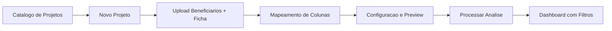
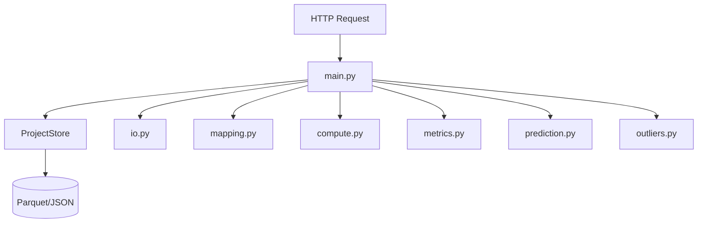
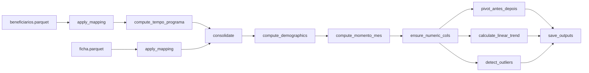
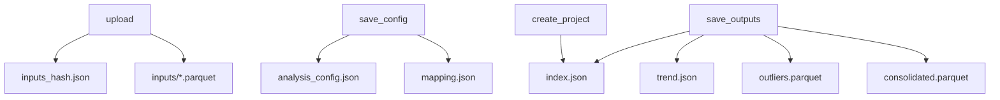
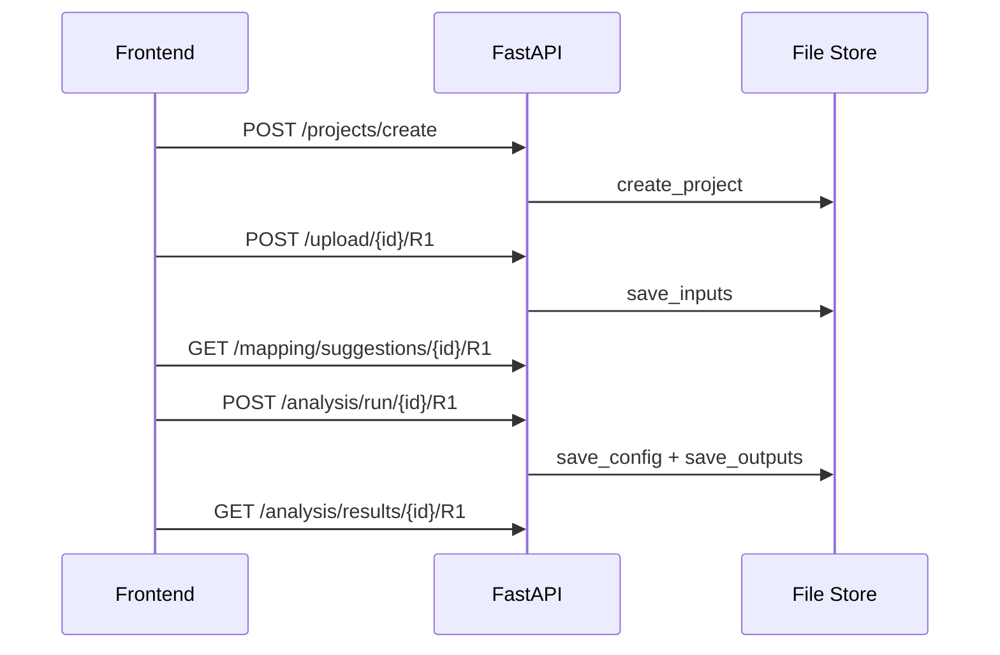
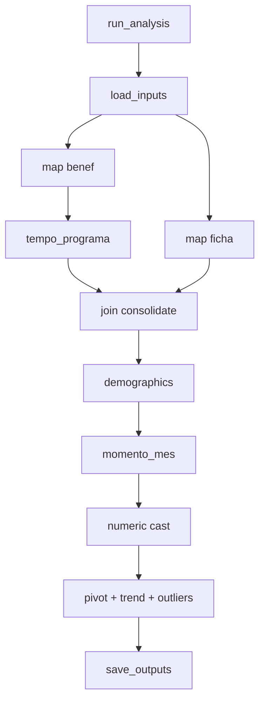

# Fluxos de Dados

## Fluxo do usuário

```mermaid
flowchart LR
A[Catalogo de Projetos] --> B[Novo Projeto]
B --> C[Upload Beneficiarios + Ficha]
C --> D[Mapeamento de Colunas]
D --> E[Configuracao e Preview]
E --> F[Processar Analise]
F --> G[Dashboard com Filtros]
```

## Fluxo backend

```mermaid
flowchart TD
R[HTTP Request] --> M[main.py]
M --> DB[ProjectStore]
M --> IO[io.py]
M --> MAP[mapping.py]
M --> CMP[compute.py]
M --> MET[metrics.py]
M --> PRED[prediction.py]
M --> OUT[outliers.py]
DB --> FS[(Parquet/JSON)]
```

## Fluxo ETL

```mermaid
flowchart LR
I1[beneficiarios.parquet] --> A[apply_mapping]
I2[ficha.parquet] --> B[apply_mapping]
A --> C[compute_tempo_programa]
C --> D[consolidate]
B --> D
D --> E[compute_demographics]
E --> F[compute_momento_mes]
F --> G[ensure_numeric_cols]
G --> H[pivot_antes_depois]
G --> I[calculate_linear_trend]
G --> J[detect_outliers]
H --> O[save_outputs]
I --> O
J --> O
```

## Fluxo de armazenamento

```mermaid
flowchart TD
P[create_project] --> IDX[index.json]
U[upload] --> IN[inputs/*.parquet]
U --> HASH[inputs_hash.json]
CFG[save_config] --> C1[mapping.json]
CFG --> C2[analysis_config.json]
RUN[save_outputs] --> O1[consolidated.parquet]
RUN --> O2[outliers.parquet]
RUN --> O3[trend.json]
RUN --> IDX
```

## Fluxo API

```mermaid
sequenceDiagram
participant UI as Frontend
participant API as FastAPI
participant ST as File Store
UI->>API: POST /projects/create
API->>ST: create_project
UI->>API: POST /upload/{id}/R1
API->>ST: save_inputs
UI->>API: GET /mapping/suggestions/{id}/R1
UI->>API: POST /analysis/run/{id}/R1
API->>ST: save_config + save_outputs
UI->>API: GET /analysis/results/{id}/R1
```

## Fluxo de processamento

```mermaid
flowchart TD
S[run_analysis] --> L[load_inputs]
L --> MB[map benef]
L --> MF[map ficha]
MB --> TP[tempo_programa]
TP --> JN[join consolidate]
MF --> JN
JN --> DG[demographics]
DG --> MM[momento_mes]
MM --> NM[numeric cast]
NM --> KPI[pivot + trend + outliers]
KPI --> SV[save_outputs]
```
